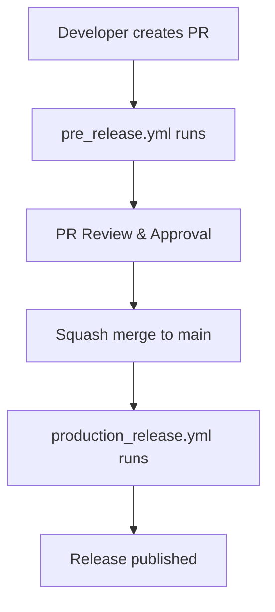

# Python Workflows

This directory contains reusable GitHub Actions workflows specifically designed for Python projects using **Trunk-Based Development** and **Conventional Commits**.

## 🚨 Important Notice

> **⚠️ WARNING**: These workflows are **complementary** and designed to work together. Using only one workflow may not provide complete functionality. For optimal results, use both workflows as part of your complete CI/CD pipeline.

## 📋 Available Workflows

### 1. Pre-Release Workflow (`pre-release-python.yml`)

**Purpose**: Handles Pull Request validation and pre-release testing.

**Triggers**:

- Pull Request events (opened, synchronize)
- Manual workflow dispatch

**What it does**:

- 🧹 **Linting & Type Checking**: Runs Ruff + MyPy
- 🔒 **Security Analysis**: Runs Bandit security scanner
- 🧪 **Testing & Coverage**: Runs pytest with coverage analysis
- 📦 **Pre-release Publishing**: Publishes to TestPyPI (if deployable)
- 📚 **Documentation Preview**: Generates documentation preview
- 📝 **Changelog Preview**: Generates changelog from conventional commits

**Output**: TestPyPI package, PR comments with reports

### 2. Production Release Workflow (`production-release-python.yml`)

**Purpose**: Handles production releases and deployment.

**Triggers**:

- Push to main branch (after PR merge)
- Manual workflow dispatch

**What it does**:

- 🔍 **Branch Detection**: Finds the original PR branch from squash commit
- 🧪 **Final Testing**: Runs tests on the merged code
- 📝 **Version Generation**: Creates semantic version based on branch name
- 📋 **Changelog Generation**: Creates release changelog from conventional commits
- 🚀 **Production Publishing**: Publishes to PyPI production
- 📚 **Documentation Deployment**: Deploys docs to GitHub Pages
- 🔖 **Git Tagging**: Creates version tags
- 🛡️ **CodeQL Analysis**: Runs security analysis

**Output**: PyPI package, GitHub Pages docs, Git tags, GitHub release

## 🔄 Workflow Relationship



## 🚀 Usage Examples

### Complete CI/CD Pipeline

```yaml
# .github/workflows/ci.yml
name: CI/CD Pipeline

on:
  pull_request:
    types: [opened, synchronize]
  push:
    branches: [main]

jobs:
  pre-release:
    if: github.event_name == 'pull_request'
    uses: ./.github/workflows/pre-release-python.yml
    with:
      python-version: "3.11"
      src-dir: "src"
      test-dir: "tests"
      coverage-threshold: "85"
      linter-fail-on: "any"
      security-fail-on: "medium"
    secrets:
      github-token: ${{ secrets.GITHUB_TOKEN }}
      pypi-secret: ${{ secrets.TEST_PYPI_TOKEN }}
      codecov-token: ${{ secrets.CODECOV_TOKEN }}

  production-release:
    if: github.event_name == 'push' && github.ref == 'refs/heads/main'
    uses: ./.github/workflows/production-release-python.yml
    with:
      python-version: "3.11"
      src-dir: "src"
      test-dir: "tests"
      coverage-threshold: "85"
      github-sha: ${{ github.sha }}
    secrets:
      github-token: ${{ secrets.GITHUB_TOKEN }}
      pypi-secret: ${{ secrets.PYPI_TOKEN }}
      codecov-token: ${{ secrets.CODECOV_TOKEN }}
    permissions:
      contents: write
      pages: write
      id-token: write
      security-events: write
```

### Individual Workflow Usage

```yaml
# Using only pre-release workflow
name: PR Checks
on:
  pull_request:
    types: [opened, synchronize]

jobs:
  checks:
    uses: ./.github/workflows/pr-release-python.yml
    with:
      python-version: "3.11"
    secrets:
      github-token: ${{ secrets.GITHUB_TOKEN }}
```

## ⚙️ Configuration

### Required Secrets

| Secret | Description | Required For |
|--------|-------------|--------------|
| `GITHUB_TOKEN` | GitHub token for PR comments | Both workflows |
| `PYPI_TOKEN` | PyPI API token for production | Production release |
| `TEST_PYPI_TOKEN` | TestPyPI token for pre-release | Pre-release |
| `CODECOV_TOKEN` | Codecov token for coverage | Both workflows |

### Input Parameters

Both workflows support extensive configuration through input parameters:

- **Python version**: Specify Python version to use
- **Directories**: Configure source, test, and docs directories
- **Thresholds**: Set coverage and security thresholds
- **PyPI settings**: Configure PyPI URLs and credentials
- **Deployment settings**: Control when to deploy/publish

## 🔧 Customization

### Modifying Workflows

1. **Copy workflows**: Copy to your repository's `.github/workflows/` directory
2. **Modify parameters**: Adjust input parameters for your project
3. **Add custom steps**: Insert additional steps as needed
4. **Configure secrets**: Set up required secrets in repository settings

### Project Structure

Ensure your project follows this structure:

```text
your-python-project/
├── src/                    # Source code
├── tests/                  # Test files
├── docs/                   # Documentation
├── pyproject.toml          # Project configuration
├── requirements.txt        # Dependencies
└── .github/
    └── workflows/          # Your workflow files
```

## 📚 Documentation

- **Main README**: [../../README.md](../../README.md) - Complete project documentation
- **Action Documentation**: [../../actions/](../../actions/) - Individual action documentation
- **Examples**: [../examples/](../../examples/) - Demo workflows

## 🤝 Contributing

When contributing to these workflows:

1. **Test thoroughly**: Ensure changes work with both workflows
2. **Update documentation**: Keep this README current
3. **Follow conventions**: Use conventional commits
4. **Consider compatibility**: Ensure changes don't break existing functionality

## 📞 Support

- **Issues**: [GitHub Issues](https://github.com/the-reacher-data/massive-devops/issues)
- **Discussions**: [GitHub Discussions](https://github.com/the-reacher-data/massive-devops/discussions)
- **Documentation**: [Project Wiki](https://the-reacher-data.github.io/massive-devops//)

---

## Made with ❤️ for the Python community
