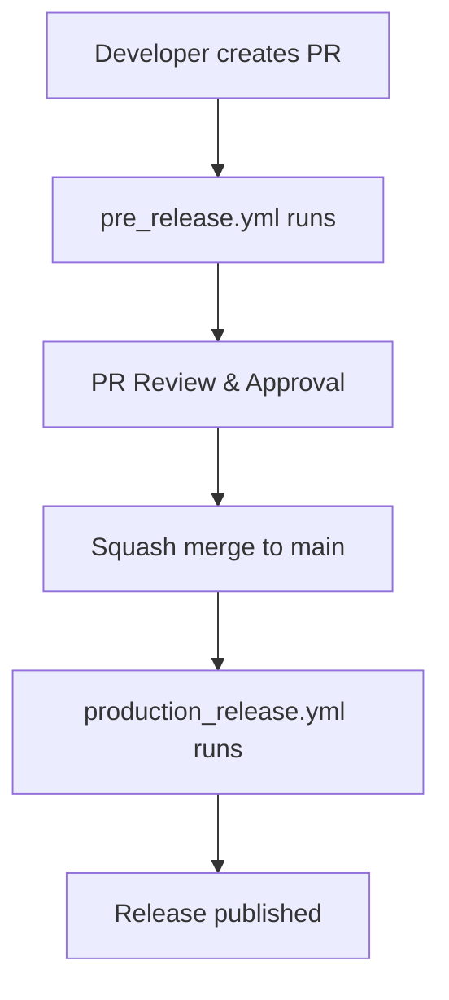

# Massive DevOps

A comprehensive collection of GitHub Actions designed for Python projects using **Trunk-Based Development** and **Conventional Commits**. This repository provides a complete DevOps toolkit that automates code quality, testing, security analysis, documentation generation, and package publishing.

> **Status**: This project is currently in development but already functional. All actions are working and can be used in production environments.

## 🚀 Features

- **Trunk-Based Development**: Optimized for continuous integration with main branch workflows
- **Conventional Commits**: Automatic changelog generation and semantic versioning
- **Complete Python Workflow**: From linting to publishing
- **Enterprise-Ready**: Professional reports with logos, badges, and detailed analysis
- **Modular Design**: Use individual actions or combine them for complete workflows

## 📋 Actions Overview

| Category | Action | Description | Status |
|----------|--------|-------------|--------|
| **DevOps** | [changelog-conventional-commit](./actions/devops/changelog-conventional-commit/README.md) | Generate changelogs from conventional commits | ✅ Ready |
| **DevOps** | [pr-comment-update](./actions/devops/pr-comment-update/README.md) | Update PR comments with custom content | ✅ Ready |
| **DevOps** | [versioning-branch-semantic](./actions/devops/versioning-branch-semantic/README.md) | Semantic versioning based on branch names | ✅ Ready |
| **Python** | [autogenerate-docs](./actions/python/autogenerate-docs/README.md) | Generate and deploy Sphinx documentation | ✅ Ready |
| **Python** | [linter-comment](./actions/python/linter-comment/README.md) | Run Ruff + MyPy and post PR comments | ✅ Ready |
| **Python** | [pytest-comment](./actions/python/pytest-comment/README.md) | Run tests with coverage and post reports | ✅ Ready |
| **Python** | [security-comment](./actions/python/security-comment/README.md) | Run Bandit security analysis and post reports | ✅ Ready |
| **Python** | [publish-package](./actions/python/publish-package/README.md) | Build and publish packages to PyPI | ✅ Ready |
| **Python** | [uv-requirements](./actions/python/uv-requirements/README.md) | Install Python dependencies using uv | ✅ Ready |

## 🏗️ Architecture

### Trunk-Based Development Workflow

This toolkit is designed around **Trunk-Based Development** principles:

- **Main Branch**: All development happens on the main branch
- **Short-Lived Branches**: Feature branches are merged quickly
- **Continuous Integration**: Every commit triggers quality checks
- **Automated Releases**: Semantic versioning and changelog generation

### Conventional Commits Integration

All actions support **Conventional Commits** specification:

- **Automatic Categorization**: Commits are grouped by type (feat, fix, docs, etc.)
- **Changelog Generation**: Automatic changelog creation from commit messages
- **Semantic Versioning**: Version bumps based on commit types
- **Release Notes**: Professional release documentation

## 🚀 Quick Start

### 1. Basic Python Project Setup

```yaml
name: Python CI/CD
on:
  push:
    branches: [main]
  pull_request:
    types: [opened, synchronize]

jobs:
  quality:
    runs-on: ubuntu-latest
    steps:
      - uses: actions/checkout@v4

      # Install dependencies
      - uses: ./actions/python/uv-requirements
        with:
          requirements: requirements.txt

      # Run linting and type checking
      - uses: ./actions/python/linter-comment
        with:
          src-dir: src
          github-token: ${{ secrets.GITHUB_TOKEN }}

      # Run tests with coverage
      - uses: ./actions/python/pytest-comment
        with:
          test-dir: tests
          src-dir: src
          github-token: ${{ secrets.GITHUB_TOKEN }}

      # Security analysis
      - uses: ./actions/python/security-comment
        with:
          src-dir: src
          github-token: ${{ secrets.GITHUB_TOKEN }}
```

### 2. Complete Release Workflow

```yaml
name: Release
on:
  push:
    tags:
      - 'v*'

jobs:
  release:
    runs-on: ubuntu-latest
    steps:
      - uses: actions/checkout@v4
        with:
          fetch-depth: 0

      # Generate changelog
      - uses: ./actions/devops/changelog-conventional-commit
        with:
          mode: release
          branch: main
          version: ${{ github.ref_name }}

      # Generate documentation
      - uses: ./actions/python/autogenerate-docs
        with:
          mode: release
          src-dir: src
          docs-dir: docs

      # Publish package
      - uses: ./actions/python/publish-package
        with:
          pypi-url: https://upload.pypi.org/legacy/
          pypi-user-name: ${{ secrets.PYPI_USERNAME }}
          pypi-secret: ${{ secrets.PYPI_PASSWORD }}
```

## 📚 Documentation

Each action has comprehensive documentation with:

- **Usage examples**: Basic and advanced configurations
- **Parameter reference**: Complete input/output documentation
- **Workflow integration**: Ready-to-use workflow examples
- **Troubleshooting**: Common issues and solutions
- **Best practices**: Recommended configurations and patterns

## 🛠️ Dependencies

### Core Tools

- **Python 3.8+**: All actions support modern Python versions
- **uv**: Fast Python package manager for dependency installation
- **Git**: Required for version control operations

### Quality Tools

- **Ruff**: Fast Python linter and formatter
- **MyPy**: Static type checker
- **Bandit**: Security linter
- **pytest**: Testing framework
- **coverage**: Code coverage measurement

### Documentation & Publishing

- **Sphinx**: Documentation generator
- **Furo**: Modern Sphinx theme
- **build**: Python package builder
- **twine**: Package uploader

## 🔧 Configuration

### Project Structure

```text
your-python-project/
├── src/                    # Source code
│   └── your_package/
├── tests/                  # Test files
├── docs/                   # Documentation
├── .github/
│   └── workflows/          # GitHub Actions workflows
├── pyproject.toml          # Project configuration
├── requirements.txt        # Dependencies
└── README.md
```

### pyproject.toml Example

```toml
[build-system]
requires = ["setuptools>=61.0", "wheel", "build"]
build-backend = "setuptools.build_meta"

[project]
name = "your-package"
version = "1.0.0"
description = "Your package description"
requires-python = ">=3.8"

[tool.ruff]
line-length = 88
target-version = "py38"

[tool.ruff.lint]
select = ["E", "F", "W", "I", "N", "UP", "B", "A", "C4", "T20"]

[tool.mypy]
python_version = "3.8"
warn_return_any = true
warn_unused_configs = true

[tool.pytest.ini_options]
testpaths = ["tests"]
addopts = "-v --tb=short"

[tool.coverage.run]
source = ["src"]
omit = ["tests/*"]

[tool.bandit]
exclude_dirs = ["tests", "migrations"]
```

## 🚦 Workflow Patterns

### Complete CI/CD Workflows

This repository includes **two complementary workflows** designed to work together:

#### 1. Pre-Release Workflow (`workflows/python/pre_release.yml`)

**Purpose**: Handles Pull Request validation and pre-release testing.

**Triggers**: Pull Request events (opened, synchronize)

**What it does**:

- 🧹 **Linting & Type Checking**: Runs Ruff + MyPy
- 🔒 **Security Analysis**: Runs Bandit security scanner
- 🧪 **Testing & Coverage**: Runs pytest with coverage analysis
- 📦 **Pre-release Publishing**: Publishes to TestPyPI (if deployable)
- 📚 **Documentation Preview**: Generates documentation preview
- 📝 **Changelog Preview**: Generates changelog from conventional commits

#### 2. Production Release Workflow (`workflows/python/production_release.yml`)

**Purpose**: Handles production releases and deployment.

**Triggers**: Push to main branch (after PR merge)

**What it does**:

- 🔍 **Branch Detection**: Finds the original PR branch from squash commit
- 🧪 **Final Testing**: Runs tests on the merged code
- 📝 **Version Generation**: Creates semantic version based on branch name
- 📋 **Changelog Generation**: Creates release changelog from conventional commits
- 🚀 **Production Publishing**: Publishes to PyPI production
- 📚 **Documentation Deployment**: Deploys docs to GitHub Pages
- 🔖 **Git Tagging**: Creates version tags
- 🛡️ **CodeQL Analysis**: Runs security analysis

> **⚠️ WARNING**: These workflows are **complementary** and designed to work together. Using only one workflow may not provide complete functionality. For optimal results, use both workflows as part of your complete CI/CD pipeline.

### Workflow Relationship



### Quick Start with Workflows

```yaml
# .github/workflows/ci.yml
name: CI/CD Pipeline

on:
  pull_request:
    types: [opened, synchronize]
  push:
    branches: [main]

jobs:
  pre-release:
    if: github.event_name == 'pull_request'
    uses: ./.github/workflows/python/pre_release.yml
    with:
      python-version: "3.11"
      src-dir: "src"
      test-dir: "tests"
      coverage-threshold: "85"
    secrets:
      github-token: ${{ secrets.GITHUB_TOKEN }}
      pypi-secret: ${{ secrets.TEST_PYPI_TOKEN }}

  production-release:
    if: github.event_name == 'push' && github.ref == 'refs/heads/main'
    uses: ./.github/workflows/python/production_release.yml
    with:
      python-version: "3.11"
      src-dir: "src"
      test-dir: "tests"
      github-sha: ${{ github.sha }}
    secrets:
      github-token: ${{ secrets.GITHUB_TOKEN }}
      pypi-secret: ${{ secrets.PYPI_TOKEN }}
    permissions:
      contents: write
      pages: write
      id-token: write
```

For detailed workflow documentation, see [workflows/python/README.md](workflows/python/README.md).

## 🤝 Contributing

This project is actively developed and welcomes contributions:

1. **Fork the repository**
2. **Create a feature branch**
3. **Follow conventional commits**
4. **Add tests for new functionality**
5. **Submit a pull request**

### Development Setup

```bash
# Clone the repository
git clone https://github.com/your-org/massive-devops.git
cd massive-devops

# Install dependencies
pip install -r requirements-dev.txt

# Run tests
pytest tests/

# Run linting
ruff check .
mypy .
```

## 📄 License

This project is licensed under the MIT License - see the [LICENSE](LICENSE) file for details.

## 🙏 Acknowledgments

- **Conventional Commits**: For the commit message specification
- **Trunk-Based Development**: For the development methodology
- **Python Community**: For the excellent tooling ecosystem
- **GitHub Actions**: For the CI/CD platform

## 📞 Support

- **Issues**: [GitHub Issues](https://github.com/your-org/massive-devops/issues)
- **Discussions**: [GitHub Discussions](https://github.com/your-org/massive-devops/discussions)
- **Documentation**: [Project Wiki](https://github.com/your-org/massive-devops/wiki)

---

## Made with ❤️ for the Python community
